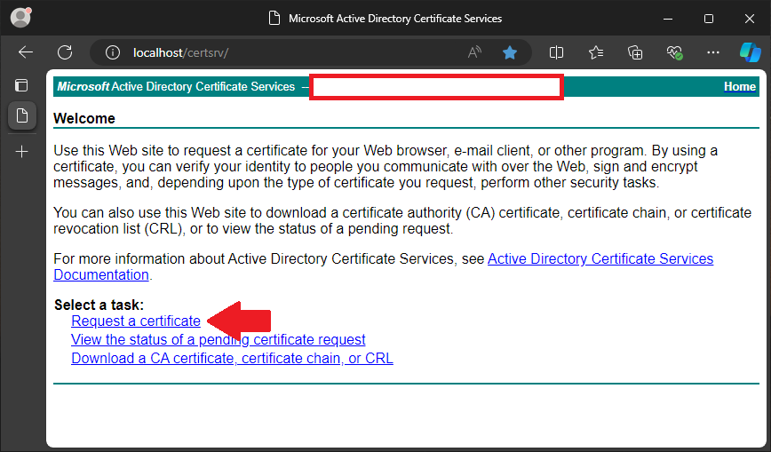
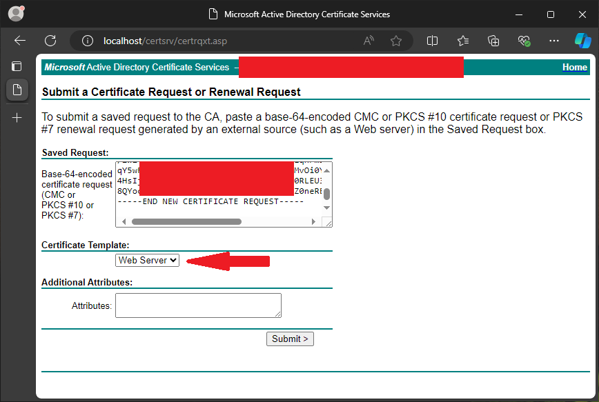

# Generate new Web Certificate in Windows Active Directory Certificate Services (AD CS)

This is a guide to create a web server certificate signed by a Root CA on Windows Active Directory Certificate Services. I use this to generate a certificate signed by my own Self Signed root certificate form a custom domain.

## Repository Navigation Guide

- [*root directory*](../README.md)
  - [/certificate-management](./README.md)
    - convert_pfx.sh
      - Script for managing and extracting components from a `.pfx` (PKCS12) bundle
    - [`generate-new-certificate.md`](.) <------------ ***YOU ARE HERE***
      - Guide to creating a new `.pfx` (PKCS12) bundle used as a web server certificate
    - [`generate-remote-desktop-certificate.md`](./generate-remote-desktop-certificate.md)
      - Guide to creating a new `.pfx` (PKCS12) bundle used as a remote desktop certificate

## Table of Contents

- [Repository Navigation Guide](#repository-navigation-guide)
- [Table of Contents](#table-of-contents)
- [Pre-requirements](#pre-requirements)
  - [Requires Windows Server Role](#requires-windows-server-role)
  - [Enable Certificate Template for Web Server](#enable-certificate-template-for-web-server)
- [Generate Web Server Certificate](#generate-web-server-certificate)
  - [Generate Web Server Certificate Request](#generate-web-server-certificate-request)
  - [Issue New Web Server Certificate](#issue-new-web-server-certificate)
  - [Import Web Server Certificate to the Domain](#import-web-server-certificate-to-the-domain)
  - [Export .pfx Web Server Certificate Bundle](#export-pfx-web-server-certificate-bundle)
  - [Convert `.pfx` to `.pem` format](#convert-pfx-to-pem-format)
    - [Export the Private Key ***with*** a password](#export-the-private-key-with-a-password)
    - [Export the Private Key ***without*** a password](#export-the-private-key-without-a-password)
    - [Export the Client certificate](#export-the-client-certificate)
    - [Export the Chain CA Certificate](#export-the-chain-ca-certificate)
- [Errata](#errata)
  - [Import Root CA into Trusted Certificates](#import-root-ca-into-trusted-certificates)
    - [Windows](#windows)

## Pre-requirements

### Requires Windows Server Role

- Active Directory Certificate Services
  - Certificate Authority
  - Certificate Authority Web Enrollment

### Enable Certificate Template for Web Server

1. Open Certificates Console
   1. Run `certsrv.msc`

      

2. Expand `Your-Domain-CA`
3. Right Click "Certificate Template" -> Select "Manage"

   

   1. Right click "Web server" -> Select "Properties"
   2. Select Security Tab
      1. Select `Authenticated Users`
      2. Allow `Enroll` Permission
      3. Select "OK"

## Generate Web Server Certificate

### Generate Web Server Certificate Request

1. Open Certificates Console
   1. Run `certlm.msc`

      

2. Create new Certificate Request
   1. *[Right Click]* Personal -> All Tasks -> Advanced Operations -> Create Custom Request

      

   2. Certificate Enrollment Window
      1. Before You Begin
         1. *Next*
      2. Select Certificate Enrollment Policy
         1. Custom Request -> Proceed without enrollment policy

            

      3. Custom request
         1. Template: `(No Template) CNG key`
         2. Request format: `PKCS #10`

            

      4. Certificate Information
         1. Expand "Details" in custom request

            

         2. Properties
            1. General Tab:
               1. Include a Friendly Name
               2. Optionally a description

                  

            2. Subject Tab:
               1. Subject Name
                  1. Type - Common Name:
                     1. Insert the primary DNS name for the cert
                     2. Example: `thing.example.com`
                  2. Type - Alternative Names:
                     1. Type the primary DNS name for the cert
                     2. Example: `thing.example.com`
                  3. Optionally add any additional "Alternative Names" as needed
                     1. DNS
                     2. IP

                  

            3. Extensions Tab:
               1. Key usage:
                  1. Digital signature
                  2. Key encipherment

                  

               2. Extended Key Usage
                  1. Server Authentication

                     

            4. Private Key Tab:
               1. Key options:
                  1. Key size: `4096`
                  2. Select "Make private key exportable"
               2. Optional
                  1. If you need to change the hashing algorithm change it in "Select Hashing Algorithm"

               

         3. Select Apply
         4. Select OK

         

      5. Select Next
      6. Save the Request to the servers file system
         - This will be denoted as the ***Certificate Request File*** in further sections.

> [!NOTE]
> You will need the "Certificate" Microsoft Management Console in a future step, it might be helpful to keep this window open, and optionally minimized.

### Issue New Web Server Certificate

1. Navigate <http://localhost/certsrv/> in any browser on the Windows Server Certificate Authority

   

2. Select "Request a certificate"

   

3. Select "Advanced certificate request"
   1. Saved Request:
      - Paste the contents of the ***Certificate Request File*** you generated in the [last step](#generate-web-server-certificate-request)
   2. Certificate Template:
      - "Web Server"

      > [!NOTE]
      > If you do not see `Web Server` in the drop down you must complete the pre-step [Enable Certificate Template for Web Server](#enable-certificate-template-for-web-server)

      

   3. Submit
4. Download certificate
   - Keep `DER encoded` option
   - Save the certificate to your file system, this will be used in the next step as ***Issued Certificate File***

   

### Import Web Server Certificate to the Domain

> [!TIP]
> "Certificate" Microsoft Management Console might still be open from the [first step](#generate-web-server-certificate-request)

1. Open Certificates Console
   1. Run `certlm.msc`

      

2. Right click "Personal" (under Certificates)
   1. Select "All task" -> "Import"

      

   2. Certificate Import Wizard
      1. Welcome to the Certificate Import Wizard
         - Next
      2. File to Import
         - Select the ***Issued Certificate File*** from the [last step](#issue-new-web-server-certificate)
      3. Certificate Store
         - Leave Certificate store as "Personal"

         

      4. Completing the Certificate Import Wizard
         - Review settings
         - Finish
      5. Make sure operation was successful

         

> [!TIP]
> How to find the newly imported certificate?
>
> 1. Ensure you have the Certificate menu open
> 2. Expand the "Certificates (Local Computer)" section on the left
> 3. Expand "Personal"
> 4. Select "Certificates" sub folder
> 5. In the menu on the center, find the certificate by the "Friendly Name" set during [Generate Certificate Request](#generate-web-server-certificate-request)

### Export .pfx Web Server Certificate Bundle

> [!TIP]
> "Certificate" Microsoft Management Console should still be open from the [previous step](#import-web-server-certificate-to-the-domain)

1. Open Certificates Console
   1. Run `certlm.msc`

      

2. Find the certificate being exported
   1. Usually found in "Personal" -> "Certificates"
3. Right click the certificate select "All tasks" -> "Export"

   

   1. Certificate Export Wizard
      1. Welcome to the Certificate Export Wizard
         - Next
      2. Export Private Key
         - Select "Yes, export the private key"
         - Next

         

      3. Export File Format
         - "Personal Information Exchange - PKCS #12 (.PFX)"
            - Include all certificate in the certificate path if possible
            - Enable certificate privacy

         

      4. Security
         1. Password
            - Enable "Password" setting
            - Type a password which will be used to encrypt the `.pfx` file generated
         2. Encryption
            - Select `AES256-SHA256`

         > [!IMPORTANT]
         > Save this password in your password manager!

         

      5. Completing the Certificate Export Wizard
         - Review settings
         - Finish
      6. Ensure the export was successful

         

### Convert `.pfx` to `.pem` format

> [!IMPORTANT]
> These commands assume you have a command line terminal with `openssl` available
>
> - Unix based system usually have this installed by default, otherwise install from your package manager of choice.
> - Windows users will likely not have it available by default, see [a stack overflow post](https://stackoverflow.com/a/51757939) on installing `openssl` on windows by installing `git` for windows ith `openssl`

#### Export the Private Key ***with*** a password

   > [!WARNING]
   > This will ask you for a new password to encrypt the private key `example.pem` with on creation.

   ```sh
   openssl pkcs12 -in example.pfx -nocerts -out example.pem
   ```

#### Export the Private Key ***without*** a password

   > [!CAUTION]
   > This will create an unprotected private key. Be sure to protect this file from exposure!

   ```sh
   openssl pkcs12 -in example.pfx -noenc -nocerts | openssl pkcs8 -nocrypt -out example.insecure.pem
   ```

#### Export the Client certificate

   ```sh
   openssl pkcs12 -in example.pfx -clcerts -nokeys | openssl x509 -out example.crt
   ```

#### Export the Chain CA Certificate

   ```sh
   openssl pkcs12 -in example.pfx -cacerts -nokeys | openssl x509 -out example.chain.crt
   ```

> [!NOTE]
> The second openssl command is used to remove extra bag details left in from the openssl pkcs1 format. Allowing you to get just the PEM format for the private key and certificate(s).

## Errata

### Import Root CA into Trusted Certificates

#### Windows

1. Open `Certificates - Local Computer`
   1. Windows search `certlm.msc`
2. Expand "Trusted Root Certification"
3. Import Certificates to Trusted Root Certificates
   1. Right click "Certificates" -> "All Tasks" -> Import...
4. Certificate Import Wizard
   1. Next
   2. Select your CERTIFICATE.cer, next
   3. Place all certificates in the following store:
      - "Trusted Root Certification Authorities"
   4. Next
   5. Finish
