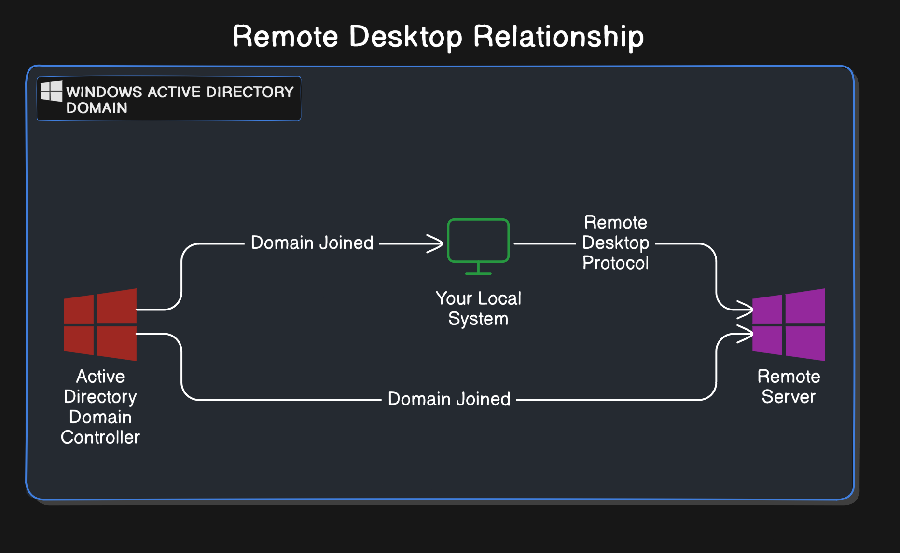
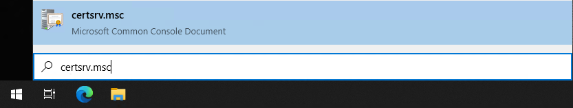
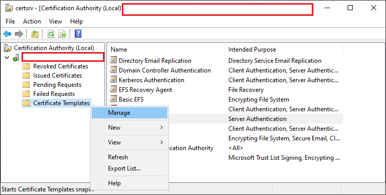
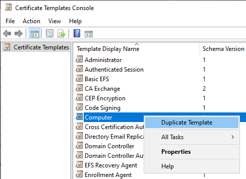

# Generate new Remote Desktop Certificate in Windows Active Directory Certificate Services (AD CS)

This is a guide to create a remote desktop certificate signed by a Root CA on Windows Active Directory Certificate Services. I use this to generate a certificate signed by my own Self Signed root certificate form a custom domain.

## Repository Navigation Guide

- [*root directory*](../README.md)
  - [/certificate-management](./README.md)
    - convert_pfx.sh
      - Script for managing and extracting components from a `.pfx` (PKCS12) bundle
    - [`generate-new-certificate.md`](./generate-custom-domain-web-certificate.md)
      - Guide to creating a new `.pfx` (PKCS12) bundle used as a web server certificate
    - [`generate-remote-desktop-certificate.md`](.) <------------ ***YOU ARE HERE***
      - Guide to creating a new `.pfx` (PKCS12) bundle used as a remote desktop certificate

## Table of Contents

- [Repository Navigation Guide](#repository-navigation-guide)
- [Table of Contents](#table-of-contents)
- [Diagram](#diagram)
- [Pre-requirements](#pre-requirements)
  - [Requires Windows Server Role](#requires-windows-server-role)
  - [Create Certificate Template for Remote Desktop Certificates](#create-certificate-template-for-remote-desktop-certificates)

## Diagram

> [!TIP]
> This guide will reference `Remote Host` which denotes the system you are Remote Desktop-ing into.
>
> 

## Pre-requirements

### Requires Windows Server Role

- Active Directory Certificate Services
  - Certificate Authority
  - Certificate Authority Web Enrollment

### Create Certificate Template for Remote Desktop Certificates

1. Open Certificates Console
    1. Run `certsrv.msc`

        

2. Expand `Your-Domain-CA`
3. Right Click "Certificate Template" -> Select "Manage"

    

    1. Right click "Computer" -> Select "Duplicate Template"

        

    2. Select General Tab
        1. Set the "Template display name"
            - `Remote Desktop`
        2. Set the "Template name"
            - ***By default*** this should mirror the "Template display name" field
            - `RemoteDesktop`
        3. Optionally change
            - Validity period
            - Renewal period
    3. Select Subject Name Tab
        1. Select "Build from this Active Directory information"
        2. Subject name format:
            - `Common Name`
        3. Include this information in alternate subject name:
            - DNS name
            - User principal name (UPN)
    4. Select "Extensions" Tab
        1. Select "Application Policy"
        2. Select Edit button
        3. Ensure "Sever Authentication" is in the list of "Application policies"
            1. If not,
            2. Select "Add"
            3. Find and double click "Server Authentication" in the list
    5. Select "Security" Tab
        1. Ensure your Group or User has the following permissions:
            - Allow:
                - Read
                - Write
                - Enroll
    6. Optional - Suggested Security Changes
        - ***NOTE***, all of these changes will increase the security of the system
            - But, these changes may have ramifications for non-windows platforms like the Linux RDP `xrdp`.
            - *I have not tested non-windows platforms yet*
        1. Select Compatibility Tab
            1. Set Compatibility Settings
                - Choose the highest your environment will uses for both items:
                  - Certification Authority
                  - Certificate recipient
        2. Select Cryptography
            1. Change Provider Category
                - Key Storage Provider
            2. Algorithm name
                - `ECDH_P256`
                - Minimum key size should match the number after the `ECDH_P` in the Algorithm
            3. Request hash
                - `SHA512`
    7. Select "Apply"
    8. Select "Ok"

> [!TIP]
> You may close both of the following windows as they are no longer needed.
>
> - Certificate Templates Console
> - Certification Authority
