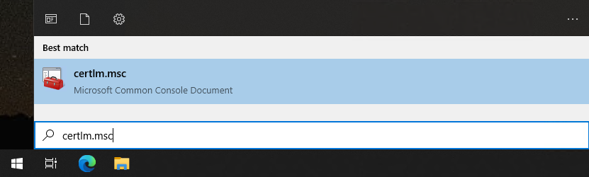
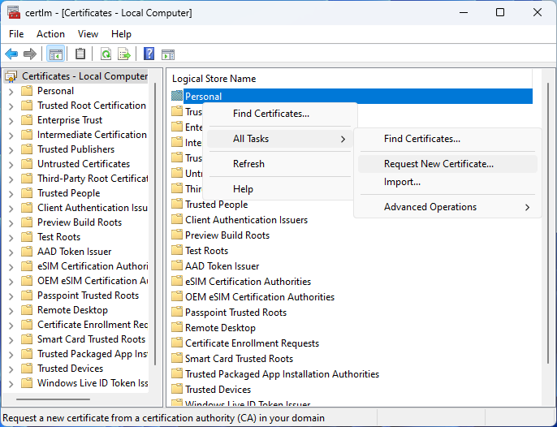
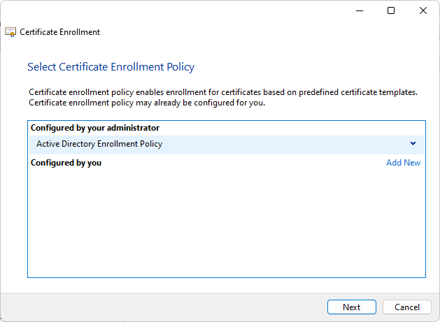
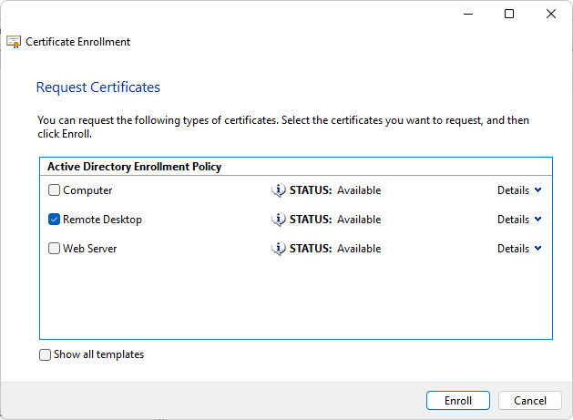
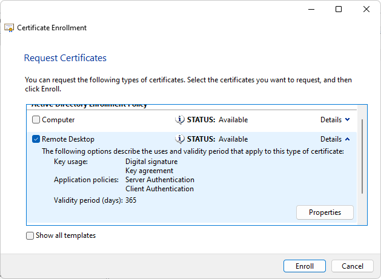
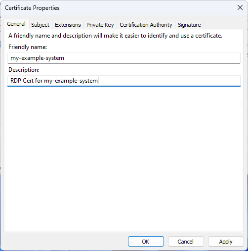
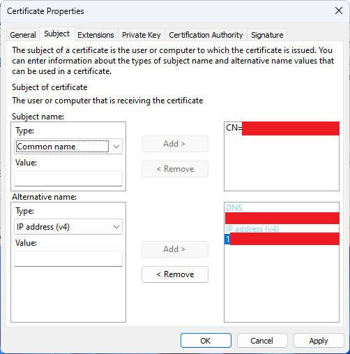
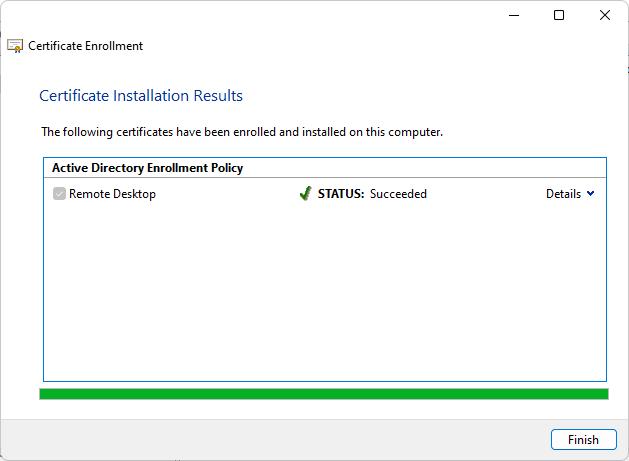

# Configure a Certificate for Remote Desktop from a Windows Domain

This is a guide to create a remote desktop certificate signed by a Root CA on Windows Active Directory Certificate Services. I use this to generate a certificate signed by my own Self Signed root certificate form a custom domain.

## Repository Navigation Guide

- [*root directory*](../README.md)
  - [/certificate-management](./README.md)
    - convert_pfx.sh
      - Script for managing and extracting components from a `.pfx` (PKCS12) bundle
    - [`generate-new-certificate.md`](./generate-custom-domain-web-certificate.md)
      - Guide to creating a new `.pfx` (PKCS12) bundle used as a web server certificate
    - [`generate-remote-desktop-certificate.md`](.) <------------ ***YOU ARE HERE***
      - Guide to creating a new `.pfx` (PKCS12) bundle used as a remote desktop certificate

## Table of Contents

- [Repository Navigation Guide](#repository-navigation-guide)
- [Table of Contents](#table-of-contents)
- [Diagram](#diagram)
- [Pre-requirements](#pre-requirements)
  - [Requires Windows Server Role for Domain Controller](#requires-windows-server-role-for-domain-controller)
  - [Target System is Joined to a Windows Active Directory Domain](#target-system-is-joined-to-a-windows-active-directory-domain)
  - [Create Certificate Template for Remote Desktop Certificates](#create-certificate-template-for-remote-desktop-certificates)
- [Set up Remote Desktop Certificate](#set-up-remote-desktop-certificate)
- [Enroll Remote Server in a Remote Desktop Certificate](#enroll-remote-server-in-a-remote-desktop-certificate)

## Diagram

> [!TIP]
> This guide will reference `Remote Host` which denotes the system you are Remote Desktop-ing into.
>
> 

## Pre-requirements

### Requires Windows Server Role for Domain Controller

- Active Directory Certificate Services
  - Certificate Authority
  - Certificate Authority Web Enrollment

### Target System is Joined to a Windows Active Directory Domain

> [!Important]
> The ***Remote Server*** must be domain joined to an *Active Directory Domain* which has a managed root certificate.

### Create Certificate Template for Remote Desktop Certificates

> [!Important]
> You must be a domain administrator or have permission to create, duplicate, and manage certificate template.

0. Login to your the Domain Control with Certificate Authority

1. Open Certificates Console
    1. Run `certsrv.msc`

        

2. Expand `Your-Domain-CA`
3. Right Click "Certificate Template" -> Select "Manage"

    

    1. Right click "Computer" -> Select "Duplicate Template"

        

    2. Select General Tab
        1. Set the "Template display name"
            - `Remote Desktop`
        2. Set the "Template name"
            - ***By default*** this should mirror the "Template display name" field
            - `RemoteDesktop`
        3. Optionally change
            - Validity period
            - Renewal period
    3. Select Subject Name Tab
        1. Select "Build from this Active Directory information"
        2. Subject name format:
            - `Common Name`
        3. Include this information in alternate subject name:
            - DNS name
            - User principal name (UPN)
    4. Select "Extensions" Tab
        1. Select "Application Policy"
        2. Select Edit button
        3. Ensure "Sever Authentication" is in the list of "Application policies"
            1. If not,
            2. Select "Add"
            3. Find and double click "Server Authentication" in the list
    5. Select "Security" Tab
        1. Ensure your Group, like Domain Administrator has the following permissions:
            - Allow:
                - Read
                - Write
                - Enroll
    6. Optional - Suggested Security Changes
        - ***NOTE***, all of these changes will increase the security of the system
            - But, these changes may have ramifications for non-windows platforms like the Linux RDP `xrdp`.
            - *I have not tested non-windows platforms yet*
        1. Select Compatibility Tab
            1. Set Compatibility Settings
                - Choose the highest your environment will uses for both items:
                  - Certification Authority
                  - Certificate recipient
        2. Select Cryptography
            1. Change Provider Category
                - Key Storage Provider
            2. Algorithm name
                - `ECDH_P256`
                - Minimum key size should match the number after the `ECDH_P` in the Algorithm
            3. Request hash
                - `SHA512`
    7. Select "Apply"
    8. Select "Ok"

> [!TIP]
> You may close both of the following windows as they are no longer needed.
>
> - Certificate Templates Console
> - Certification Authority

## Set up Remote Desktop Certificate

### Enroll Remote Server in a Remote Desktop Certificate

0. Login to your the ***Remote Server*** as a Domain Administrator with permissions to issue the "Remote Desktop Template" generate in [Create Certificate Template for Remote Desktop Certificates](#create-certificate-template-for-remote-desktop-certificates)

1. Open Certificates Console
    1. Run `certlm.msc`

        

2. Create new Certificate for Remote Desktop
    1. *[Right Click]* Personal -> All Tasks -> Request New Certificate

        

    2. Generate Certificate Request
        1. Before You Begin
            - Select Next
        2. Select Certificate Enrollment Policy
            1. Select "Active Directory Enrollment Policy"
            2. Next

                

        3. Request Certificates
            1. Check the box for "Remote Desktop" certificate template created in [Create Certificate Template for Remote Desktop Certificates](#create-certificate-template-for-remote-desktop-certificates)

                

            2. Select "Details" for "Remote Desktop" certificate template

                

            3. Select "Properties" for "Remote Desktop" certificate template being issues

            4. Edit the properties for "Remote Desktop" certificate template being issues

                1. Certificate Properties - General Tab
                    1. Enter a "Friendly name" used to identify the certificate from the list of certificates on a system.
                    2. Optionally: Add a Description

                    

                2. Certificate Properties - Subject Tab
                    1. Subject name
                        1. Enter the Remote Host's DNS name as a "Common name" entry
                    2. Optional - Alternative name
                        1. Enter any other DNS names you will use to connect to the Remote Host's System Hostname as a "DNS" entry
                        2. You can also choose to add an IP address using the "IPv4 Address" or "IPv6 Address" type and filling in the systems IP address.

                    

                3. Select Apply
                4. Select OK

        4. Select Enroll

        5. Ensure Status is "Succeeded"

            

        6. Select Finish

> [!TIP]
> You will find the certificate located in both,
>
> 1. Personal -> Certificates
> 2. Remote Desktop -> Certificates
>
> They will both show who the certificate was > Issued To and Issued By, but not the Friendly > name.
>
> To find the "Friendly name" and description > for any certificate,
>
> 1. Select a certificate to check
> 2. [Right Click] -> Properties
> 3. Select the "General" tab
>
> You will then see both the "Friendly name" and > "Description" listed.
>
> Use this to find the certificate just issued
